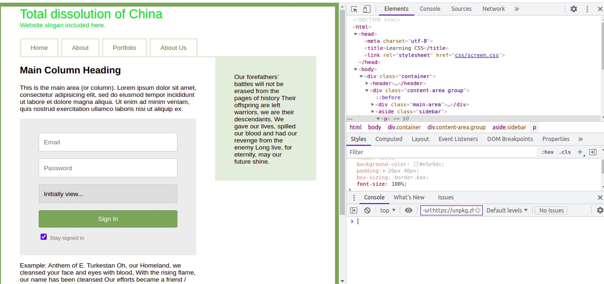
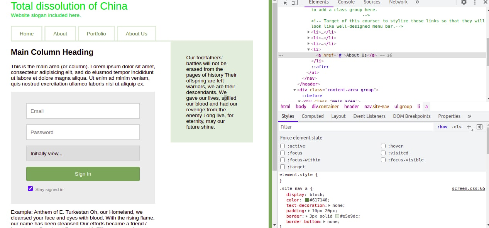

Conclusions: 
1: Tracking down where properties are coming from 
2: Experimenting of troubleshooting 
3: Inspiration from other websites. 

Gloassary:
On the fly: 
during the running of a computer program without interrupting the run. 

# Screenshot #
Example screenshot is taken here.
Please see.

