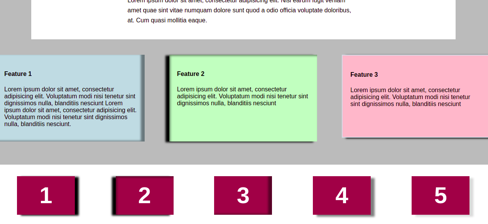

## notes ##

box-shadow: h-offset v-offset blur(optional) color 
positive: right/up negative: left/down 
inner shadow: add an inset as prefix 

.box-b: combination of external an internal shadow.<-----Use comma. 

## effect ##
